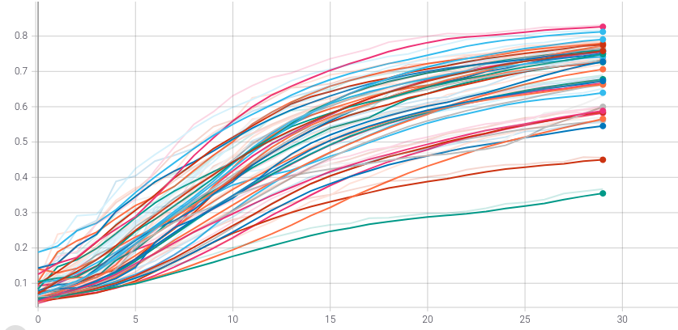
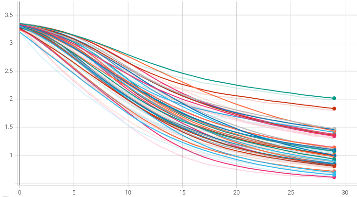
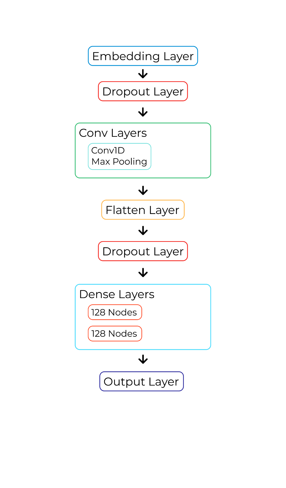
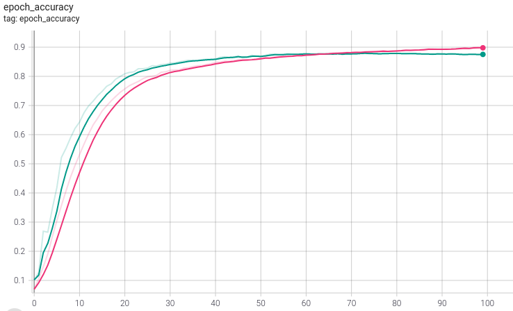
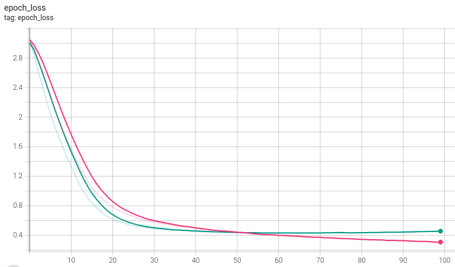
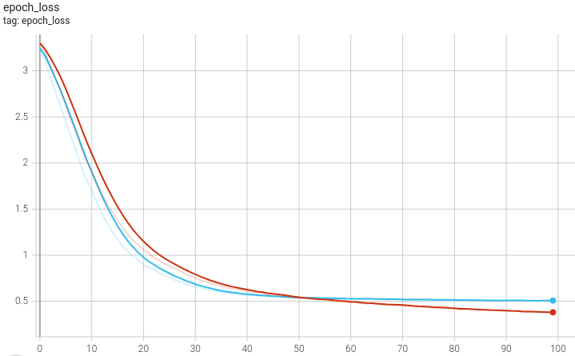

This is a a document going through my approach to training a document classification model during my internship at Eisenvault
 
 Some parts have been removed
 
 # Index
1. # Dataset
   1. ## Dataset Generation
   1. ## Dataset Distribution
   1. ## Pruning Dataset
   1. ## Balancing Dataset
1. # Neural Network Architecture
   1. ## Analysis of the Problem
   1. ## Reviewing different architectures
   1. ## Decided Architecture
1. # Models and Training
   1. ## Data Preprocessing
   1. ## Basic structure
   1. ## Training and Optimization
   1. ## Analysis
   1. ## Final Model
1. # Model Performance
   1. ## Level 3
   1. ## Level 2
   1. ## Level 1
1. # Documents

Dataset
# Dataset Generation
The dataset was generated from the documents present in [Luminous1](https://drive.google.com/drive/folders/1BW2lC4nPR9302ZGEICoVHPRq9Ir78jTl?usp=sharing).

The documents were first scanned by an OCR and then if they were in a language other than english they were translated.

In the dataset comprised of 27,768 documents and had 43 different document types
# Dataset Distribution
The distribution of the dataset was as follows:

|
Certificates : 1272

ComputerCertificate : 105

Deploma : 262

GraduationCertificate : 1411

HigherSecondaryCertificate : 1081

PostGraduationCertificate : 171

SrSecondary : 696

Applicationform : 1185

Checklist : 150

CV : 1095

InterviewAssessmentForm : 879

Joiningreport : 1148

MediclaimeCoverageForm : 989

SalarySlip : 2033

Agreement : 73

Amalgamation : 1

AppointmentLetter : 1439

CompensationStatement : 797

ConfidentialInternalLetter : 1594

Confirmationletter : 516

Employeeletter : 1524

VoterId : 498
|
Form16 : 27

GratuityFormF : 1184

IncrementLetter : 166

LeaveCertificate : 26

Letterofintent : 95

Maintenance : 1

ManPowerRequestform : 497

NETIXIS : 91

OfferOfEmployment : 893

Other : 2003

PromotionLetters : 27

ReleivingLetter : 644

Subscription\_Reservation : 16

TransferLetter : 173

TransferRequestForm : 63

BankAccountDetails : 980

DrivingLicence : 575

Insurances : 12

PanCard : 989

Passport : 337

RationCard : 50

|
| :- | :- |

# Pruning Dataset
Dataset Pruning is the process of unclassifiable document types.

The code for this can be found [here](https://colab.research.google.com/drive/113zXBklf1QHxOaLPF4-EHThj8-yI5x_l?usp=sharing)

The Pruning was done in 3 levels each removing document types that fell below a certain threshold 

**Level 1**

This removed document types with less than 50 instances, the impact of this level of pruning was negligible.

The following document types were removed:

Amalgamation 1

Form16 27

LeaveCertificate 26

Maintenance 1

PromotionLetters 27

Subscription\_Reservation 16

Insurances 12

RationCard 50

**Level 2**

This removed document types with less than 150 instances, it has a slightly higher impact on the dataset than level 1 however still retains most important document types

The following document types were removed:

ComputerCertificate 105

Checklist 150

Agreement 73

Amalgamation 1

Form16 27

LeaveCertificate 26

Letterofintent 95

Maintenance 1

NETIXIS 91

PromotionLetters 27

Subscription\_Reservation 16

TransferRequestForm 63

Insurances 12

RationCard 50

**Level 3**

This removed document types with less than 500 instances, it has a large impact on the dataset reducing its size to more than half but is still useful as an example of how well the model could perform with a better dataset

The following document types were removed:

ComputerCertificate 105

Deploma 262

PostGraduationCertificate 171

Checklist 150

Agreement 73

Amalgamation 1

Form16 27

IncrementLetter 166

LeaveCertificate 26

Letterofintent 95

Maintenance 1

ManPowerRequestform 497

NETIXIS 91

PromotionLetters 27

Subscription\_Reservation 16

TransferLetter 173

TransferRequestForm 63

Insurances 12

Passport 337

RationCard 50

VoterId 498
# Balancing Dataset
**Oversampling** and **Undersampling** are methods of addressing an imbalanced datasets which makes it more effective for certain neural network architectures (like KNN).

**Oversampling** involves randomly selecting examples of the minority classes (document types with low number of instances) and adding them to the dataset.

**Undersampling** involves randomly removing instances of the majority classes (document types with high number of instances) from the dataset.

However I need to be careful how dataset balancing is done because it does have the potential to introduce unwanted biases into the dataset. For example, oversampling a document type with really few instances would lead to the model just memorizing those specific documents instead of learning patterns for identifying them.

Various different types of Balanced Datasets were generated and later tested.

Neural Network Architecture
# Analysis of the Problem
Due to the large number of document types and the documents having on average about a thousand words per document, simple neural networks are unlikely to perform well.

Larger batch sizes should be used to ensure no document type gets skipped.

Measures should be put in place to avoid overfitting since it's extremely likely to go unnoticed in classifiers with large number of types.

Since we are working with arbitrary length strings which are difficult for neural networks to process, using a tokenizer which converts the strings into a set of vectors would greatly improve performance and training speed. This should be more effective than older approaches like bag of words or simple character encoding.

#
#
#
##

# Reviewing different architectures
## KNN - K nearest neighbor algorithm
It is one of the most used learning algorithms due to its simplicity.

A KNN stores all the available data and classifies a new data point based on the similarity measure (e.g., distance functions). This means when new data appears. Then it can be easily classified into a well-suited category..

However this has some drawbacks which make it unsuitable for us

- High memory requirement as it needs to store all of the training data.
- Extremely sensitive to dataset imbalances.
- Slow predictions with large datasets.
- Stores all of the training making it computationally expensive.

## CNN - Convolutional Neural Network
This is a type of neural  network usually used for problems involving images or other forms of 2 dimensional data however recently through some minor changes to the model and data preprocessing it is being applied to tasks like sentiment analysis and other text classification problems.
# Decided Architecture
I chose to use a CNN for the following reasons

- Fast training time
- Good performance in similar problems.
- Currently being used by major companies for similar tasks.
- Unaffected by dataset imbalances.
- I have previous experience with using this architecture making it easier to implement

Models and Training
# Data Preprocessing
Plain text by itself is difficult to process by a neural network so to combat that I will be using a tokenizer, which allows us to vectorize a text corpus, by turning each text into either a sequence of integers (each integer being the index of a token in a dictionary) or into a vector.

After the documents have been converted into vectors we add padding to make all the classes have the same size which is necessary for CNNs.

# Basic Structure

**Embedding layer:** It enables us to convert each word into a fixed length vector of defined size. The resultant vector is a dense one with real values instead of just 0's and 1's. The fixed length of word vectors helps us to represent words in a better way along with reduced dimensions.

**Dropout layer:** It randomly sets input units to 0 with a frequency of rate at each step during training time, which helps prevent overfitting.

**Convolutional layers:** They apply a convolution operation to the input, passing the result to the next layer.

**Flatten Layer:** It converts the pooled feature map to a single column that is passed to the fully connected layer.

**Dense Layers:** After flattening, the flattened feature map is passed through a series regular deeply connected neural network layers called Dense Layers

**Output Layer:** This is the layer responsible for producing the final result of our neural network and the number of nodes in this layer depends on the number of document types in the dataset used.

# Training and Optimization
The preprocessing is followed by Convolutional Layers with the activation function rectify linear each of which is accompanied by Max Pooling layer to progressively reduce the spatial size and reduce the amount of parameters and computation in the network.

The input is then flattened and passed into a group of Dense Layers and then finally passed into the output layer which returns our predictions.

##
##
##
##

## Testing
I experimented with 3 parameters, the number of Conv Layers, the number of Dense Layers and the number of nodes in each hidden layer.

The following models were trained for 30 epochs with a batch size of 500 on all the different datasets with the intention of analyzing the models to determine which of these will perform the best.

|1-conv[32,32]-dense 1-conv[64,32]-dense 1-conv[128,32]-dense 1-conv[64,64]-dense 1-conv[128,64]-dense 1-conv[128,128]-dense 1-conv[32,0]-dense 1-conv[64,0]-dense 1-conv[128,0]-dense 2-conv[32,32]-dense 2-conv[64,32]-dense 2-conv[128,32]-dense 2-conv[64,64]-dense 2-conv[128,64]-dense 2-conv[128,128]-dense 2-conv[32,0]-dense 2-conv[64,0]-dense 2-conv[128,0]-dense|
| :- |

After training the models were analyzed with the help of tensorboard which you can view [here](https://colab.research.google.com/drive/1-0NyZOsxIa7Gk7IfbQgUP3sPdSO43Drw?usp=sharing)

Epoch Accuracy

Epoch Loss

# Analysis
- Balancing the dataset does not affect performance significantly.
- Models with a single convolutional layer perform better and are less likely to overfit. (other than a few exceptions which were later looked into)
- Larger dense layers showed a better performance.
#
#
#
#
#
#
#
#
#

# Final Model
The models with the best performance were selected and trained for more number or epochs and finally the 1-conv[128,128]-dense  was selected and was then trained on all 3 levels of the dataset for 100 epochs.

Model Performance
# Level 3
loss: 0.3080 - accuracy: 0.8976 - val\_loss: 0.4595 - val\_accuracy: 0.8757

# Level 2
loss: 0.3880 - accuracy: 0.8773 - val\_loss: 0.5049 - val\_accuracy: 0.8554

# Level 1
` `loss: 0.4121 - accuracy: 0.8725 - val\_loss: 0.5154 - val\_accuracy: 0.8519

Documents
- ## [Using the trained models](https://colab.research.google.com/drive/1XEkTgeNVq-n5fUb4g1cWsMPF-LdL1gk2?usp=sharing)
- ## [Training Code](#_j4w4chdgj2ff)
- ## [Dataset Pruning](https://colab.research.google.com/drive/113zXBklf1QHxOaLPF4-EHThj8-yI5x_l?usp=sharing)
- ## [Final Trained models and logs](https://drive.google.com/drive/folders/1BYlSuOpiOGqontcuTEV_nFQccHXqtXBk?usp=sharing)
- ## [Training Session Graphs](https://drive.google.com/drive/folders/1UhNWzggGrh4ZzvvDgEBk2U21BH7cvzKP?usp=sharing)

